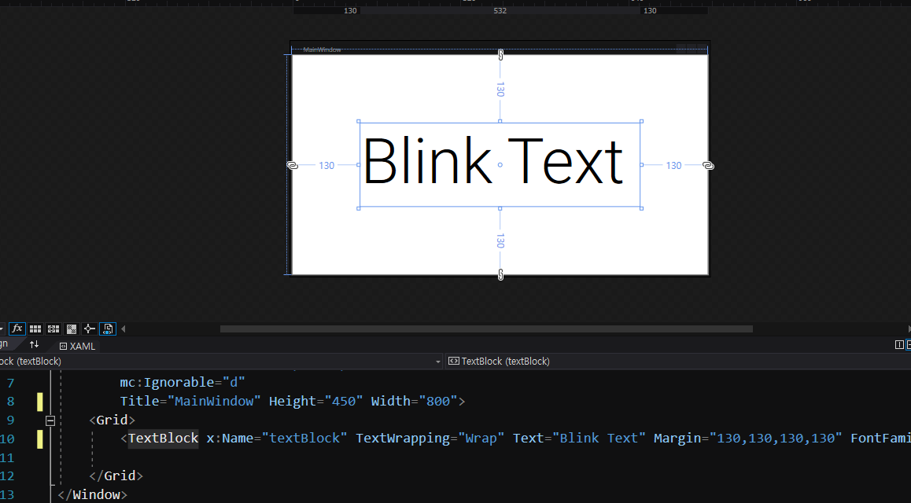
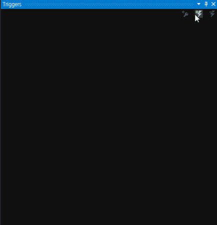
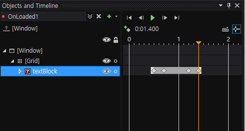
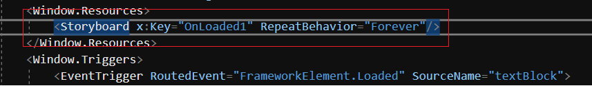

<h2>Blend 작업</h2>
<h3>Window(View) Xaml</h3>
<pr>Textblock 추가</pr>

<pr></pr>
<h3>Blend</h3>
<pr>Trigger 창에서 Add trigger event 클릭 후 TextBlock이 Loaded 됐을 때 Action 추가</pr>

<pr></pr>
<pr>생성된 스토리보드에서 0.5초 Opacity 0, 0.7초 Opacity 0, 1.2초 Opacity 100, 1.4초 Opacity 100 Setting 후 저장</pr>

<pr></pr>
<h3>Window(View) Xaml</h3>
<pr>생성된 스토리보드의 RepeatBehavior 속성을 Forever로 변경

<pr></pr>
<pr>실행화면</pr>

