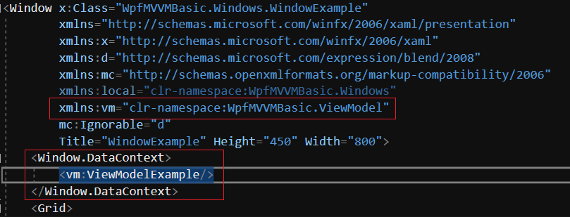

<h2>Binding 순서</h2>
<h3>ViewModel</h3>
<pr>전처리 추가</pr>

```C#
using WpfMVVMBasic.MVVM; //for ObservableObject
using System.Windows.Input; //for ICommand 
using System.Collections.ObjectModel; //for ObservableCollection 
using System.Windows; 
using System.Diagnostics; 
using System.Threading; 
```
<pr>내부 내용 추가</pr>
```C#
        #region member

        #endregion

        #region constructor
        public ViewModelFrame() //생성자 부분, 클래스 이름에 맞게 변경
        {

        }
        #endregion

        #region command
        public ICommand Operation { get { return new RelayCommand(OperationExcute); } }
        void OperationExcute()
        {

        }
        #endregion

        #region method
        #endregion
```

<h3>Window(View) Xaml</h3>
<pr>Xmal 네임스페이스 링크 추가</pr>

```C#
xmlns:vm="clr-namespace:WpfMVVMBasic.ViewModel"
```

<pr> Data Context 연결 </pr>

```C#
    <Window.DataContext>
        <vm:ViewModelExample/>
    </Window.DataContext>
```


