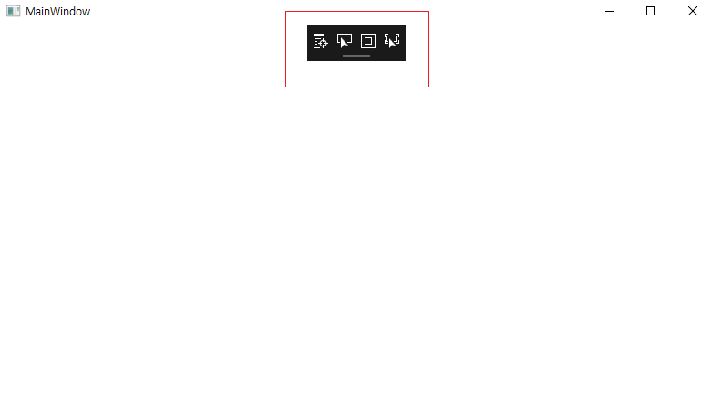
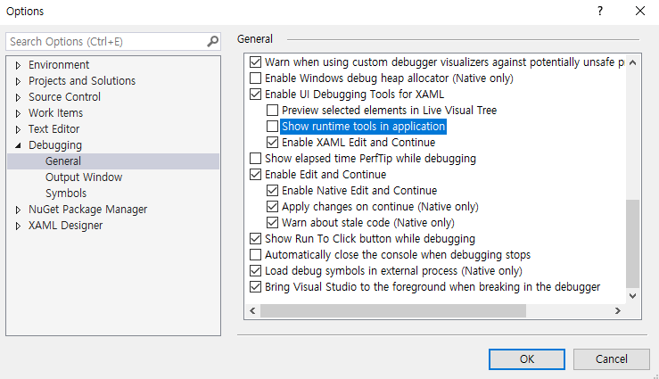
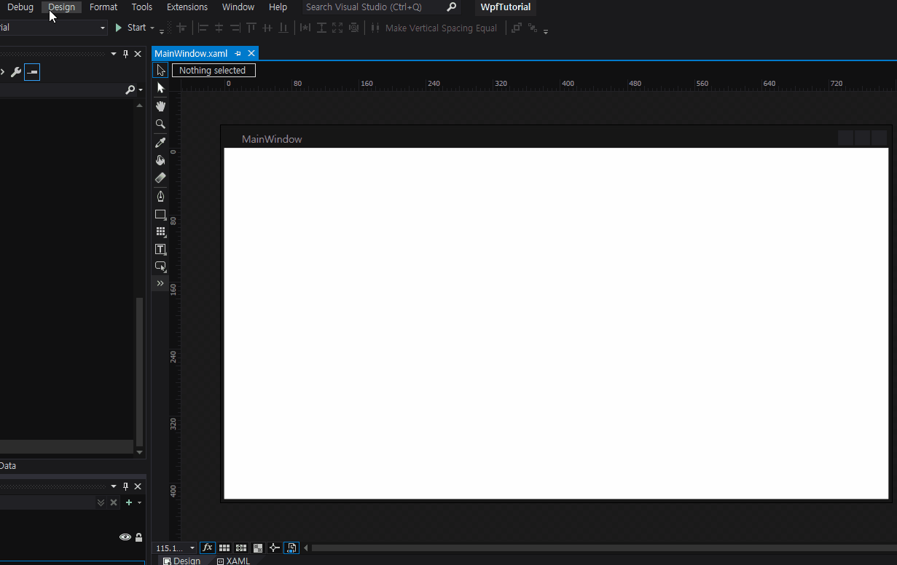
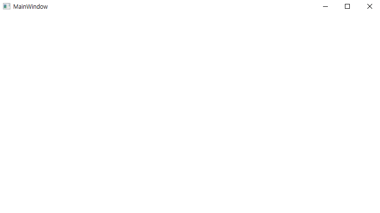

<h2>UI Debugging Tool 제거</h2>
<pr>Debugging 실행 시 아래 화면과 같이 UI Debugging Tool 도킹이 Default 상태이다.</pr>

<pr></pr>
<pr>간단히 옵션에서 'Show runtime tools in application' 체크박스를 해제하면 된다. 

<pr></pr>

<pr></pr>
<pr>실행 화면</pr>

